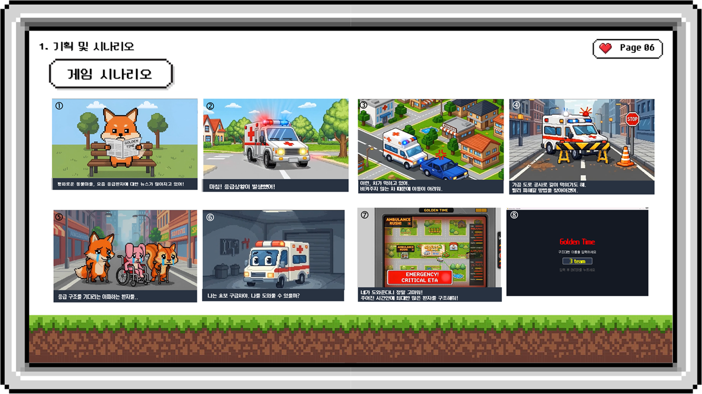
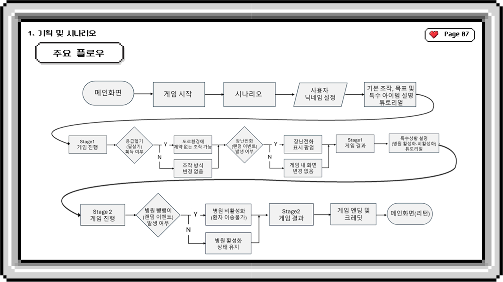
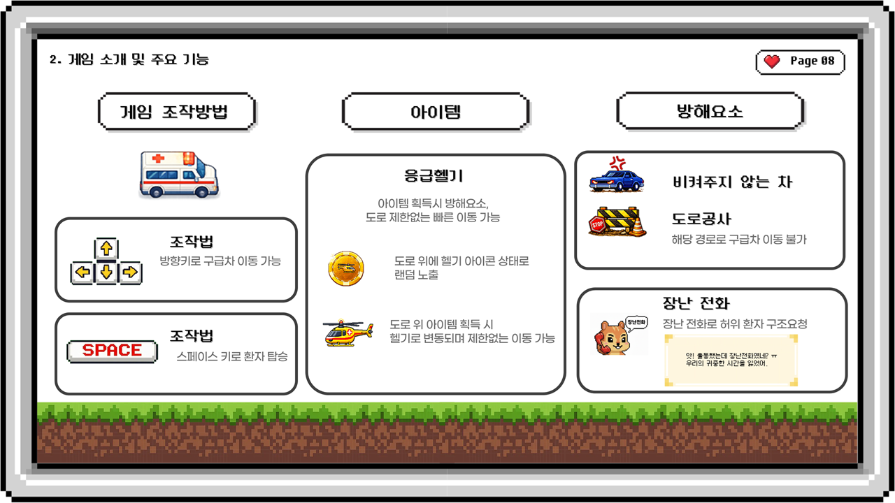
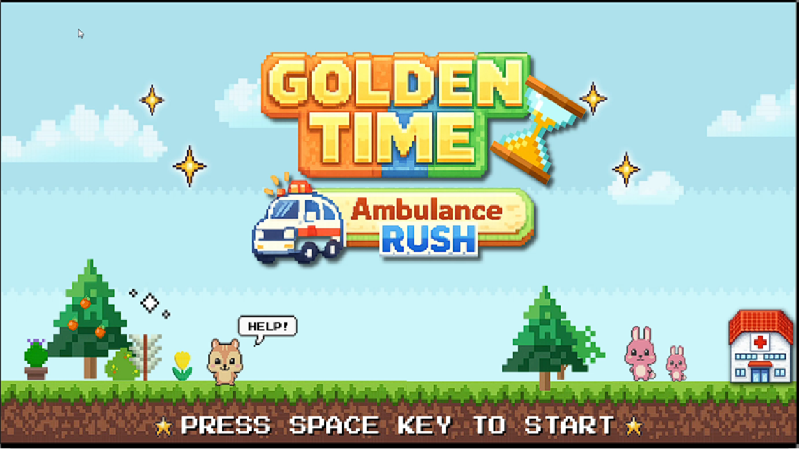
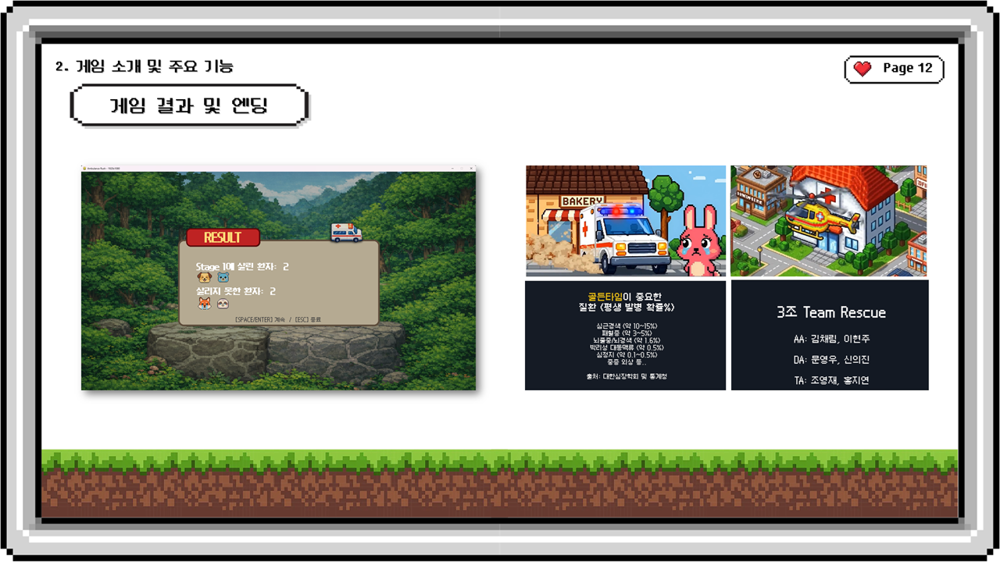

# 🚑 Golden Time Ambulance Rush  
### Pygame 기반 응급구조 교육용 2D 픽셀 게임

> 응급환자 이송 과정에서 발생할 수 있는 골든타임, 교통 방해, 장난전화, 병원 이송 문제를  
> 2D 픽셀 게임 방식으로 체험할 수 있도록 제작한 Python/Pygame 기반 교육용 게임 프로젝트입니다.

<br/>

## 🔗 Project Links

| 구분 | 링크 |
|---|---|
| 발표자료 | [https://docs.google.com/presentation/d/1AzATAAFfrbb5XIVH7tkDmFeABYqcEvdJ/edit?usp=sharing&ouid=116000083308723048290&rtpof=true&sd=true] |
| GitHub Repository | [https://github.com/0jae0517/goldenrush.git] |
| Demo Video | [https://drive.google.com/file/d/19WavkDQVVu7H-xQwbZJn3TGOdWZKZQD4/view?usp=sharing] |

<br/>

---

## 🛠 Tech Stack


<br/>

---

# 1. 기획

## 1-1. Project Overview

**Golden Time Ambulance Rush**는 응급환자를 제한 시간 안에 병원으로 이송하는 것을 목표로 하는  
2D 픽셀 스타일의 교육용 게임입니다.

플레이어는 구급차를 조작하여 환자가 발생한 위치로 이동하고,  
환자를 탑승시킨 뒤 병원으로 이송해야 합니다.

게임 내에는 실제 응급구조 상황을 단순화한 요소들이 포함되어 있습니다.

- 골든타임 제한
- 도로 공사 및 비켜주지 않는 차량
- 장난전화로 인한 허위 출동
- 병원 활성/비활성 상태
- 응급헬기 아이템
- 구조 성공/실패 결과 화면
- 인트로·아웃트로 컷신

<br/>

---

## 1-2. Background & Problem

최근 응급환자 이송 지연, 병원 수용 문제, 장난전화 등으로 인해  
환자의 생명과 직결되는 **골든타임 확보**의 중요성이 강조되고 있습니다.

본 프로젝트는 이러한 공공보건 이슈를 어렵고 무겁게 전달하기보다,  
사용자가 직접 게임을 플레이하며 응급구조 환경의 어려움과 골든타임의 중요성을 체험할 수 있도록 기획되었습니다.

<br/>

### 문제 정의

| 문제점 | 설명 |
|---|---|
| 골든타임 인식 부족 | 응급환자 이송 시간이 생명과 직결된다는 점을 직관적으로 체감하기 어려움 |
| 응급차 이동 방해 | 도로 상황, 비켜주지 않는 차량, 공사 등으로 이송 지연 발생 가능 |
| 장난전화 문제 | 허위 신고로 인해 실제 응급환자 구조 시간이 지연될 수 있음 |
| 병원 이송 문제 | 병원 수용 여부에 따라 이송 경로와 시간이 달라질 수 있음 |
| 교육 콘텐츠 부족 | 청소년이나 일반 시민이 쉽게 접근할 수 있는 체험형 응급구조 교육 콘텐츠 필요 |

<br/>

---

## 1-3. Game Scenario

게임은 평화로운 동물마을에서 응급상황이 발생하면서 시작됩니다.  
플레이어는 초보 구급차를 도와 환자를 구조하고, 제한 시간 안에 병원까지 이송해야 합니다.

<br/>



<br/>

---

## 1-4. Game Flow

게임은 시작 화면, 시나리오, 닉네임 설정, 튜토리얼, Stage 1, Stage 2, 엔딩 순서로 진행됩니다.  
Stage 1에서는 기본 구조 규칙을 학습하고, Stage 2에서는 병원 활성/비활성 이벤트가 추가되어 난이도가 상승합니다.

<br/>



<br/>

---

# 2. 개발

## 2-1. Development Summary

본 프로젝트는 Python의 **Pygame** 라이브러리를 활용하여 개발한 2D 타일 기반 게임입니다.

타일 맵 데이터를 기반으로 도로, 병원, 환자 발생 위치를 구성하고,  
플레이어 이동, 충돌 처리, 환자 탑승 및 이송, 장애물 생성, 아이템 획득, 시간 제한 시스템을 구현했습니다.

<br/>

### 전체 개발 흐름

```text
게임 기획 및 시나리오 작성
        ↓
픽셀아트 기반 맵/캐릭터/오브젝트 에셋 구성
        ↓
Pygame 화면 및 타일 맵 시스템 구현
        ↓
플레이어 이동 및 충돌 처리 구현
        ↓
환자 발생, 탑승, 병원 이송 로직 구현
        ↓
장애물 및 장난전화 이벤트 구현
        ↓
응급헬기 아이템 및 스테이지 시스템 구현
        ↓
BGM/SFX, 인트로/아웃트로 컷신 추가
        ↓
튜토리얼 및 결과 화면 구현
        ↓
데모 시연 및 개선사항 정리
```

<br/>

---

## 2-2. Core Game System

### 1. Tile Map System

게임 맵은 2차원 배열 기반으로 구성했습니다.  
각 숫자는 도로, 병원, 환자 발생 위치 등 게임 오브젝트의 역할을 의미합니다.

<br/>

| 값 | 의미 |
|---|---|
| `0` | 이동 불가 영역 |
| `1` | 도로 |
| `2` | 병원 |
| `3` | 환자 발생 위치 |

<br/>

### 2. Player Movement & Collision

플레이어는 방향키로 구급차를 조작합니다.  
구급차는 도로 위에서만 이동할 수 있으며, 장애물이 있는 칸으로는 이동할 수 없습니다.

단, 응급헬기 아이템을 획득하면 일시적으로 도로 제한과 장애물의 영향을 받지 않고 이동할 수 있습니다.

<br/>

### 3. Patient Rescue System

환자가 발생한 위치로 이동한 뒤 `SPACE` 키를 누르면 환자를 탑승시킬 수 있습니다.  
환자를 태운 상태에서 병원에 도착한 뒤 다시 `SPACE` 키를 누르면 구조가 완료됩니다.

<br/>

### 4. Golden Time System

각 환자에게는 제한 시간이 존재합니다.  
골든타임 안에 병원으로 이송하지 못하면 구조 실패로 처리됩니다.

<br/>

### 5. Fake Call Event

일정 확률로 장난전화 이벤트가 발생합니다.  
허위 환자 요청일 경우 구조 대상이 아니므로 시간이 낭비되며, 응급구조 환경에서 장난전화가 미치는 영향을 게임적으로 표현했습니다.

<br/>

### 6. Obstacle System

도로 위에는 공사 구간이나 비켜주지 않는 차량이 장애물로 등장합니다.  
장애물은 구급차의 이동 경로를 제한하며, 플레이어는 우회 경로를 찾아야 합니다.

<br/>

### 7. Emergency Helicopter Item

도로 위에 랜덤으로 응급헬기 아이템이 생성됩니다.  
아이템을 획득하면 구급차가 헬기로 전환되고, 일정 시간 동안 도로와 장애물 제한 없이 이동할 수 있습니다.

<br/>

### 8. Hospital Activation System

Stage 1에서는 모든 병원이 활성화되어 있지만,  
Stage 2에서는 일부 병원만 랜덤으로 활성화되어 난이도가 증가합니다.

<br/>

### 9. Tutorial & Cutscene System

처음 플레이하는 사용자를 위해 튜토리얼을 구성했습니다.  
인트로와 아웃트로 영상, 자막 타이핑 효과, BGM/SFX를 활용하여 게임 메시지를 자연스럽게 전달했습니다.

<br/>

---

## 2-3. Controls, Items & Obstacles

게임의 주요 조작법은 방향키 이동과 `SPACE` 키 상호작용입니다.  
아이템과 방해요소를 통해 실제 응급구조 상황에서 발생할 수 있는 지연 요소를 게임적으로 표현했습니다.

<br/>



<br/>

### 주요 기능 요약

| 구분 | 기능 | 설명 |
|---|---|---|
| 조작 | 방향키 이동 | 구급차를 상하좌우로 이동 |
| 조작 | SPACE 키 | 환자 탑승 및 병원 이송 처리 |
| 아이템 | 응급헬기 | 획득 시 장애물과 도로 제한 없이 이동 가능 |
| 방해요소 | 비켜주지 않는 차 | 해당 경로로 구급차 이동 불가 |
| 방해요소 | 도로공사 | 이동 경로 차단 |
| 방해요소 | 장난전화 | 허위 환자 구조 요청으로 시간 낭비 유도 |

<br/>

---

## 2-4. Main Features

| 기능 | 설명 |
|---|---|
| 시작 화면 | `PRESS SPACE KEY TO START` 방식의 게임 시작 화면 |
| 이름 입력 | 사용자의 구조대원 이름 입력 기능 |
| 튜토리얼 | 이동, 환자 탑승, 장애물 회피, 헬기 사용법 안내 |
| 스테이지 진행 | Stage 1, Stage 2 구조 미션 진행 |
| 환자 구조 | 환자 위치 이동 → SPACE 탑승 → 병원 이송 → SPACE 하차 |
| 골든타임 타이머 | 환자별 제한 시간 내 이송 필요 |
| 장난전화 | 허위 신고 이벤트를 통한 방해 요소 구현 |
| 장애물 | 도로 공사, 비켜주지 않는 차량 등 이동 제한 요소 |
| 응급헬기 | 아이템 획득 시 빠른 이동 가능 |
| 결과 화면 | 구조 성공/실패 환자 수 표시 |
| 엔딩 | 아웃트로 영상 및 엔딩 크레딧 재생 |

<br/>

---

## 2-5. Key Implementation

### 플레이어 이동 및 충돌 처리

- 방향키 입력 감지
- 이동 방향에 따른 구급차 이미지 변경
- 다음 이동 칸이 도로인지 확인
- 장애물 위치와 충돌 여부 확인
- 헬기 상태에서는 이동 제한 완화

<br/>

### 환자 구조 로직

```text
환자 위치 도착
        ↓
SPACE 키 입력
        ↓
진짜 환자 여부 확인
        ↓
환자 탑승 상태 변경
        ↓
병원 위치 도착
        ↓
활성화 병원 여부 확인
        ↓
SPACE 키 입력
        ↓
구조 성공 처리
```

<br/>

### 장애물 및 경로 보장

장애물을 랜덤으로 생성하되,  
플레이어가 환자에게 도달할 수 없는 맵이 생성되지 않도록 경로 존재 여부를 확인하는 로직을 구성했습니다.

<br/>

### 스테이지 난이도 조절

| 스테이지 | 특징 |
|---|---|
| Tutorial | 이동, 환자 탑승, 장애물, 헬기 사용법 학습 |
| Stage 1 | 모든 병원 활성화 |
| Stage 2 | 일부 병원만 랜덤 활성화되어 난이도 상승 |

<br/>

### 시청각 요소

- Pygame Mixer 기반 BGM 재생
- 게임 오버, 장난전화, 헬기, 시간 제한 효과음 구현
- OpenCV를 활용한 인트로/아웃트로 영상 재생
- 자막 타이핑 효과 적용
- 픽셀 폰트 및 캐릭터 이미지 적용

<br/>

---

## 2-6. Project Structure

```text
Golden_Time_Ambulance_Rush/
├── pygame_goldenrush.py
│
├── asset/
│   ├── bgm/
│   ├── sfx/
│   ├── ui/
│   ├── map/
│   ├── car/
│   ├── heli/
│   ├── hospital/
│   ├── obstacle/
│   ├── intro/
│   ├── outro/
│   ├── font/
│   └── readme/
│       ├── 01_starting_screen.png
│       ├── 02_scenario.png
│       ├── 03_flow.png
│       ├── 04_조작법.png
│       └── 05_ending.png
│
├── docs/
│   └── presentation.pdf
│
└── README.md
```

<br/>

---

## 2-7. How to Run

### 1. Install Requirements

```bash
pip install pygame opencv-python numpy
```

<br/>

### 2. Run Game

```bash
python pygame_goldenrush.py
```

<br/>

> 실행 시 `asset` 폴더의 이미지, 폰트, BGM, SFX, 영상 파일 경로가 필요합니다.

<br/>

---

# 3. 결과

## 3-1. Game Preview

### Start Screen

게임 시작 화면입니다.  
사용자는 `SPACE` 키를 눌러 게임을 시작할 수 있습니다.

<br/>



<br/>

---

### Scenario

응급구조 문제와 골든타임의 중요성을 전달하기 위한 게임 시나리오입니다.

<br/>


<br/>

---

### Main Flow

게임의 전체 진행 흐름입니다.  
메인 화면부터 튜토리얼, Stage 1, Stage 2, 엔딩까지 이어지는 구조로 설계했습니다.

<br/>


<br/>

---

### Controls & Game Elements

게임 조작법, 아이템, 방해요소를 정리한 화면입니다.

<br/>


<br/>

---

### Result & Ending

게임 결과 화면과 엔딩 화면입니다.  
구조 성공/실패 결과를 보여주고, 응급구조의 중요성을 다시 전달합니다.

<br/>



<br/>

---

## 3-2. Result Summary

본 프로젝트를 통해 Python/Pygame 기반 2D 게임 개발의 전체 흐름을 경험했습니다.

특히 단순 화면 출력이 아니라,  
게임 상태 관리, 충돌 처리, 랜덤 이벤트, 시간 제한, 튜토리얼, 컷신, 사운드까지 포함한  
완성형 미니게임 구조를 구현했습니다.

<br/>

### 구현 결과

| 구분 | 결과 |
|---|---|
| 게임 장르 | 2D 픽셀 구조 게임 |
| 개발 방식 | Python + Pygame |
| 핵심 시스템 | 이동, 충돌, 환자 구조, 장애물, 골든타임, 헬기 아이템 |
| 교육 메시지 | 응급차 양보, 골든타임, 허위 신고 문제 인식 |
| 부가 요소 | BGM/SFX, 인트로/아웃트로 영상, 튜토리얼, 결과 화면 |

<br/>

---

## 3-3. My Role

본 프로젝트에서 **TA(Technical Assistant / 기술 담당)** 역할을 수행했습니다.

<br/>

| 역할 | 수행 내용 |
|---|---|
| Pygame 게임 개발 | 2D 게임 구조 설계 및 개발 |
| 맵 상호작용 구현 | 플레이어와 맵 환경 간 이동/충돌 처리 |
| 게임 로직 구현 | 환자 탑승, 병원 이송, 구조 성공/실패 처리 |
| 스테이지 구현 | Stage 1, Stage 2 진행 구조 및 난이도 변화 구현 |
| 아이템 구현 | 응급헬기 아이템 획득 및 이동 방식 변경 |
| UI/UX 구현 | HUD, 타이머, 구조 현황, 결과 화면 구성 |
| 컷신 시스템 구현 | 인트로/아웃트로 영상 및 자막 타이핑 효과 구현 |
| 사운드 연동 | BGM, 효과음 재생 로직 구현 |

<br/>

---

## 3-4. Portfolio Highlights

이 프로젝트에서 강조할 수 있는 기술적 포인트는 다음과 같습니다.

<br/>

| 포인트 | 설명 |
|---|---|
| 상태 기반 게임 흐름 | Start, Tutorial, Playing, Result, Ending 흐름 구성 |
| 타일맵 기반 설계 | 2차원 배열로 도로, 병원, 환자 위치 관리 |
| 충돌 처리 | 이동 가능 영역과 장애물 충돌 여부 판단 |
| 경로 보장 로직 | 장애물 생성 후 환자까지 도달 가능한지 확인 |
| 랜덤 이벤트 | 환자 위치, 장애물, 헬기 아이템, 활성 병원 랜덤 처리 |
| 시간 제한 시스템 | 스테이지 타이머와 환자별 골든타임 타이머 운영 |
| 멀티미디어 연동 | OpenCV 영상 재생, Pygame Mixer 사운드 처리 |
| 교육용 게임화 | 공공보건 이슈를 게임 메커니즘으로 전달 |

<br/>

---

## 3-5. Expected Effect

본 게임은 응급구조 상황을 직접 체험하는 방식으로  
골든타임과 응급차 양보의 중요성을 전달할 수 있습니다.

<br/>

### 활용 가능성

| 구분 | 내용 |
|---|---|
| 시민 캠페인 | 응급차 양보와 골든타임의 중요성 전달 |
| 청소년 안전 교육 | 학교 수업, 보건 교육, 토의 활동과 연계 |
| 공공기관 홍보 | 병원, 소방, 지자체 응급구조 홍보 콘텐츠 |
| 전시/체험 콘텐츠 | 짧은 플레이 타임을 활용한 오프라인 체험형 콘텐츠 |

<br/>

---

## 3-6. Limitations & Future Work

### Limitations

- 현재는 정해진 맵과 제한된 스테이지 중심으로 구성됨
- 실제 도로망이나 병원 수용 데이터와 연동되지는 않음
- 플레이 기록 기반 분석 기능은 아직 제한적임
- 난이도 변화 요소가 병원 활성화와 장애물 중심으로 구성됨

<br/>

### Future Work

- 다양한 맵과 스테이지 추가
- 1차, 2차, 3차 병원 등 실제 응급의료 체계 반영
- 다양한 아이템과 방해요소 추가
- 플레이 결과 기록 기능 추가
- 구조 수, 평균 이송 시간, 실패 원인 등 데이터 기반 피드백 제공
- 교육용 퀴즈 및 정보성 문구 추가
- 웹 또는 실행 파일 형태로 배포

<br/>

---

## 3-7. Notice

본 프로젝트는 학습 및 포트폴리오 목적의 Python/Pygame 기반 교육용 게임 프로젝트입니다.  
게임 내 상황은 실제 응급의료 시스템을 단순화한 것이며, 공공보건 메시지를 전달하기 위한 체험형 콘텐츠로 제작되었습니다.
